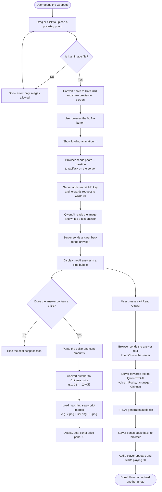

# 價錢牌小幫手 — Code Explainer for Beginners

> This guide explains the entire project as if you have never written a single line of code.
> Think of it like understanding how a vending machine works — step by step, no jargon.

---

## What Does This App Do?

**Price Tag Helper (價錢牌小幫手)** is a web app that lets you:

1. **Take a photo** of any price tag and upload it.
2. **Ask an AI** to read the price from the photo.
3. **See the price** written in ancient Chinese seal script (小篆).
4. **Hear the answer** read aloud using a text-to-speech voice.

Think of it like a super smart friend who can look at any price tag photo and tell you "That's $25.50 — it's a pack of biscuits!"

---

## The Project's Three Files

```
image-understanding/
│
├── index.html          ← The webpage the user sees and clicks on
│
├── api/
│   ├── ask.js          ← A helper that talks to the AI vision service
│   └── tts.js          ← A helper that turns text into spoken audio
│
└── images/
    ├── 1.png – 9.png   ← Seal-script digit images
    ├── shi.png          ← 十 (ten)
    ├── bai.png          ← 百 (hundred)
    ├── qian.png         ← 千 (thousand)
    ├── dollar.png       ← 圓 (dollar symbol in seal script)
    └── cent.png         ← 仙 (cent symbol in seal script)
```

---

## Part 1 — index.html (The Webpage)

### Analogy
Think of `index.html` as the **face of the vending machine** — all the buttons, screens, and slots you interact with. It is made up of three layers:

| Layer | Real-world analogy | What it does in code |
|---|---|---|
| **HTML** | The machine's physical shape | Defines buttons, text boxes, image areas |
| **CSS** | The machine's paint and design | Makes everything colorful and pretty |
| **JavaScript** | The machine's internal wiring | Makes buttons actually work |

---

### Section A — HTML Structure (The Skeleton)

```html
<div class="upload-zone" id="drop-zone">
  <input type="file" id="file-input" accept="image/*" />
```
**Plain English:** This creates the big dashed rectangle on screen that says "drag your photo here." The `accept="image/*"` part means it only accepts photo files — not videos or documents.

```html
<textarea id="question" rows="2" placeholder="問小幫手…">
  請從這張價錢牌圖片提取價格…
</textarea>
<button class="btn-ask" id="ask-btn">🔍 問！</button>
```
**Plain English:** The text box is where the question lives (it comes pre-filled). The button labelled "問！" (Ask!) is what you press to send the photo and question to the AI.

```html
<div id="seal-display">…</div>
```
**Plain English:** This invisible box will appear once a price is found, showing the price written in ancient Chinese characters.

```html
<audio id="audio-player" controls></audio>
```
**Plain English:** This is an invisible music player. Once text-to-speech audio is ready, it pops up so you can press play.

---

### Section B — CSS Styling (The Paint Job)

CSS describes *how things look*. You never need to read every line — just understand the pattern:

```css
.btn-ask {
  background: var(--red);   /* button is red */
  border-radius: 14px;       /* rounded corners */
  box-shadow: 3px 3px 0 #222; /* gives a 3-D shadow */
}
```

The `:hover` and `:active` rules make the button jump slightly when you hover or click it — that little animation that makes it feel "alive."

```css
@keyframes bounce {
  0%, 80%, 100% { transform: translateY(0); }
  40%            { transform: translateY(-8px); }
}
```
**Plain English:** This defines the bouncing animation for the three loading dots that appear while the AI is thinking. Each dot jumps up 8 pixels and comes back down, one after another.

---

### Section C — JavaScript (The Wiring)

JavaScript is the brain. It listens for things you do (click, drag, type) and reacts. Here are the key moments:

#### 1. Loading a Photo

```js
function loadFile(file) {
  const reader = new FileReader();
  reader.onload = e => {
    imageDataURL = e.target.result;   // stores the image as a long text string
    previewImg.src = imageDataURL;    // shows the preview on screen
  };
  reader.readAsDataURL(file);
}
```
**Plain English:** `FileReader` is a built-in browser tool that reads your photo file and converts it into a very long text string (called a **Data URL**). That string starts with `data:image/jpeg;base64,...` and can be sent over the internet inside a text message — like attaching a photo to a WhatsApp message, but as text.

#### 2. Sending to the AI

```js
async function askAI() {
  const resp = await fetch('/api/ask', {
    method: 'POST',
    body: JSON.stringify({ imageUrl: imageDataURL, question })
  });
  const data = await resp.json();
  const answer = data.choices[0].message.content;
}
```
**Plain English:**
- `fetch` is how a webpage sends a message to a server and waits for a reply — like texting someone and waiting for their reply.
- `POST` means "I am sending you something."
- `await` means "pause here and wait until we get a reply before continuing."
- The AI's answer comes back inside `data.choices[0].message.content`.

#### 3. Displaying the Price in Seal Script

```js
function parsePrice(text) {
  const match = text.match(/(?:HK\$|\$|港幣|HKD\s*)?(\d+)(?:[.．](\d{1,2}))?/);
  // ...
}
```
**Plain English:** This line uses a **regular expression** (a search pattern) to find a price like `$25.50` inside the AI's answer. It looks for an optional dollar sign, then digits, then optionally a dot and more digits.

```js
function numberToSealImgs(n) {
  // breaks number into thousands, hundreds, tens, ones
  // returns a list like ['2.png', 'shi.png', '5.png']  →  二十五
}
```
**Plain English:** Chinese numbers work differently. 25 is said "two-ten-five" (二十五), not "twenty-five." This function converts a regular number like 25 into the right sequence of image files to display it in the traditional Chinese way.

#### 4. Text-to-Speech (Hearing the Answer)

```js
async function speakResponse() {
  const resp = await fetch('/api/tts', {
    method: 'POST',
    body: JSON.stringify({ text })
  });
  const blob = await resp.blob();   // audio file data
  audioPlayer.src = URL.createObjectURL(blob);
  audioPlayer.play();
}
```
**Plain English:** This sends the AI's answer text to the `/api/tts` helper. That helper talks to an online voice generator. The audio file comes back as a **blob** (a chunk of binary data). We create a temporary link to that audio and plug it into the `<audio>` player, which starts playing automatically.

---

## Part 2 — api/ask.js (The AI Vision Messenger)

```js
export default async function handler(req, res) {
```
**Plain English:** This is a **serverless function** — a tiny program that only runs when it receives a request, like a cashier who only wakes up when someone walks to the counter.

```js
  const apiKey = process.env.DASHSCOPE_API_KEY;
```
**Plain English:** An **API key** is like a password that proves we are allowed to use the AI service. It is stored secretly on the server (in an "environment variable") so that no one who visits the website can steal it.

```js
  const upstream = await fetch('https://dashscope.aliyuncs.com/...', {
    body: JSON.stringify({
      model: 'qwen3.5-flash',
      messages: [{
        role: 'user',
        content: [
          { type: 'image_url', image_url: { url: imageUrl } },
          { type: 'text',      text: question }
        ]
      }]
    })
  });
```
**Plain English:** This sends the photo (as the Data URL) AND the question to **Qwen** — an AI model made by Alibaba that can both see images and understand text. The reply is then forwarded back to the webpage.

---

## Part 3 — api/tts.js (The Voice Generator)

```js
  body: JSON.stringify({
    model: 'qwen3-tts-flash',
    input: { text, voice: 'Rocky', language_type: 'Chinese' }
  })
```
**Plain English:** This sends the AI's text answer to a **Text-to-Speech** model — also from Alibaba's DashScope — using a voice called "Rocky" set to speak Chinese. The service replies with an audio file, which we pipe straight back to the user's browser.

---

## Flowchart — How the Whole App Works




---

## Key Vocabulary Glossary

| Term | What it means in plain English |
|---|---|
| **HTML** | The skeleton of a webpage — headings, buttons, boxes |
| **CSS** | The styling — colors, fonts, sizes, animations |
| **JavaScript** | The logic — what happens when you click or type |
| **API** | A way for two programs to talk to each other over the internet |
| **API Key** | A secret password that lets your app use an online service |
| **fetch** | A JavaScript command to send or receive data from a server |
| **async / await** | Wait for a slow task (like an internet call) before continuing |
| **Data URL** | A way to represent a file (like an image) as a very long text string |
| **Base64** | The encoding system used inside a Data URL |
| **Blob** | A chunk of raw binary data (like an audio or image file) |
| **Serverless function** | A tiny server program that runs only when called |
| **Environment variable** | A secret value stored on the server, not visible in the code |
| **Regular expression** | A search pattern for finding text (like finding `$25.50` in a sentence) |
| **TTS (Text-to-Speech)** | Technology that converts written text into a spoken voice |
| **Mermaid** | A text-based language for drawing flowcharts |

---

## Summary — The Big Picture

```
You (the user)
    ↓  upload a photo
Browser (index.html)
    ↓  sends photo + question
Server (/api/ask.js)
    ↓  adds secret key and forwards
Qwen AI (Alibaba Cloud)
    ↓  reads the image, writes an answer
Server
    ↓  returns the answer
Browser
    ↓  shows the answer + seal-script price
    ↓  (if you press 🔊)
Server (/api/tts.js)
    ↓  sends answer text
Qwen TTS AI
    ↓  generates audio
Browser
    ↓  plays the audio for you 🎉
```

The whole round trip from pressing "Ask" to seeing the answer typically takes **2–5 seconds** — most of that time is the AI thinking!
